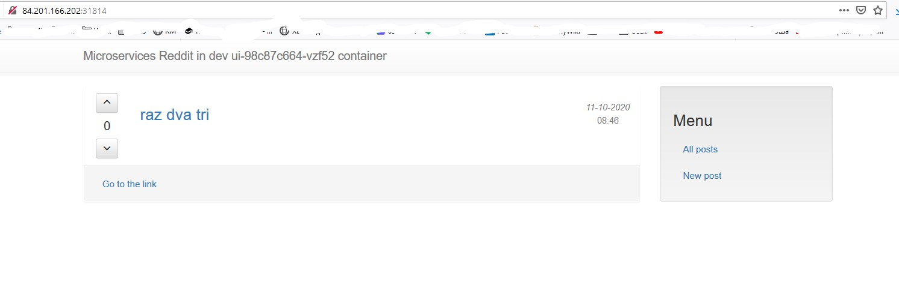

[](https://travis-ci.com/Otus-DevOps-2020-05/etoosamoe_microservices)

# etoosamoe's microservices repo

# ДЗ docker-2 (оно же докер-1)

Сегодня я поэкспериментировал с докером, раньше руки до него не доходили.
* Поставил на локальной машинке, поставил на удаленной.
* Поработал с docker-machine

* Собрал свой образ
* Загрузил его в докер-хаб
* Загрузил образ на локальную машинку под WSL2 и он даже запустился

* Собрал прототип инфры

# ДЗ docker-3

_а у меня все образы начали собираться с Step 1, который FROM, а дальше apt-get update.. странно_

Сегодня я молодец:
* загрузил кучу образов в докерхаб
* создал отдельную сеть для приложения
* сделал так, база сохранялась при пересоздании контейнеров с помощью docker volume
* оптимизировал образы, установив alpine

Создать образ на докерхабе

```bash
docker build -t etosamoe/image-name:1.0 ./folder
```

Создать сеть

```bash
docker network create reddit
```

Запустить контейнеры из образов на докерхабе:

```bash
docker run -d --network=reddit --network-alias=post_db --network-alias=comment_db -v reddit_db:/data/db mongo:latest
docker run -d --network=reddit --network-alias=post etosamoe/post:1.0
docker run -d --network=reddit --network-alias=comment etosamoe/comment:1.0
docker run -d --network=reddit -p 9292:9292 etosamoe/ui:2.0
```

# ДЗ docker-4


Сегодня покрутил сети в докере.
Закидывал контейнеры в разные сети, изолировал их друг от друга.

Поменять имя: опция  ``-p`` или ``--project-name NAME`` или переменной окружения ``COMPOSE_PROJECT_NAME``

Чтобы компоуз заработал, пришлось сделать такую штуку: ``export COMPOSE_TLS_VERSION=TLSv1_2``

# ДЗ gitlab-ci-1

 - помучился с разворачиванием докера ансиблом
 - поставил докер руками
 - запустил гитлаб и раннер
 - поигрался с пайплайнами

  Задания со звездочкой отложу на потом, если дойдут руки..

# ДЗ monitoring-1

- Ставим Prometheus в контейнерах
- Добавляем несколько джобов, экспортеров
- Делаем Мейкфайл для удобного билда и пуша образов

# ДЗ monitoring-2

- Поставил Grafana
- Создал дашборды
- Настроил алертинг
- Настроил мониторинг докер-контейнеров

Ссылка на докерхаб https://hub.docker.com/u/etosamoe

# ДЗ logging-1

Уф.
- Установил ЕФК
- Поставил Зипкин
- Посмотрел как собираются логи в Еластике, как собираются трейсы в Зипкине
- Перелопатил докер-компоуз


# Kubernetes-1

Итак, я прошел хард-вей в яндексе. Это долго, муторно, много сертификатов, конфигов..

Результат в папке ``the_hard_way`` и вывод:
```
 yadmin  kubernetes/reddit   kubernetes-1  kubectl apply -f comment-deployment.yml                        deployment.apps/comment-deployment created
 yadmin  kubernetes/reddit   kubernetes-1  kubectl apply -f ui-deployment.yml
deployment.apps/ui-deployment created
 yadmin  kubernetes/reddit   kubernetes-1  kubectl apply -f mongo-deployment.yml
deployment.apps/mongo-deployment created
 yadmin  kubernetes/reddit   kubernetes-1  kubectl apply -f post-deployment.yml
deployment.apps/post-deployment created
 yadmin  kubernetes/reddit   kubernetes-1  kubectl get pods
NAME                                 READY   STATUS    RESTARTS   AGE
busybox                              1/1     Running   0          12m
comment-deployment-d56c85c46-m4krv   1/1     Running   0          2m6s
mongo-deployment-86d49445c4-z7njj    1/1     Running   0          111s
nginx-554b9c67f9-jms9q               1/1     Running   0          6m19s
post-deployment-5b5cdd78f5-8zq54     1/1     Running   0          105s
ui-deployment-69b4467cf8-mdsfj       1/1     Running   0          119s
```

# Kubernetes-2

Я развернул наше reddit-приложение сначала в локальном кубернетесе, затем в Яндексе.
Помучился с post-db.
Вроде разобрался с пробросами портов.
Поработал с неймспейсами.
Поставил очень удобный дашборд для Кубера.


